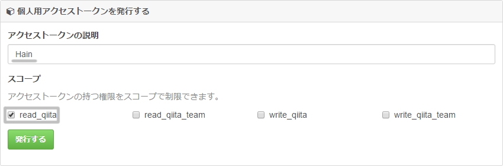

# hain-plugin-qiita
[](https://github.com/prince-0203/hain-plugin-qiita/tags)
[](https://www.npmjs.com/package/hain-plugin-qiita)
[](https://www.npmjs.com/package/hain-plugin-qiita)
[](https://www.npmjs.com/package/hain-plugin-qiita)
[](LICENSE)  
A [Hain](https://github.com/appetizermonster/hain) plugin for Qiita

# Install
1. Install plugin.

```
/hpm install qiita
```

2. Visit [個人用アクセストークンを発行する - Qiita](https://qiita.com/settings/tokens/new) and create personal access token.  


3. Open preferences(`/preferences`) and paste your token.

# Usage
## Search Qiita

```
/qiita search <something>
```

## View your stocks

```
/qiita stocks
```

## View user's stocks

```
/qiita stocks <User ID>
```
